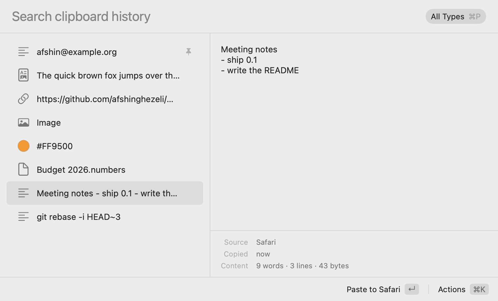

# Spindle

Clipboard history for the Mac. Press ⌃⌘V, type a few letters, press Return, and what you copied last week is pasted into the app you were using.

<picture>
  <source media="(prefers-color-scheme: dark)" srcset="docs/images/readme-panel-dark.png">
  
</picture>

I use Raycast's clipboard history every day, but it comes inside a launcher I don't otherwise need, with an account and cloud features that aren't open source. Spindle is the same workflow as a small, standalone app you can read the source of. It runs on macOS 15 and later and is written in Swift with AppKit and SwiftUI.

## What it does

- Keeps what you copy: plain and rich text, images, files, links and colors. You choose how long (from a day to forever), with a separate limit for images and a cap on disk space. Pinned items are always kept.
- Searches the whole history as you type. At 100,000 items, results arrive within 5 ms (p99 of the slowest query type, `make bench` on an M4).
- Pastes the chosen item into the app that was in front, with its formatting or as plain text, or just puts it on the clipboard.
- Pins items you reuse, in the order you choose.
- Pauses recording for 5 minutes, an hour or until you resume, and can skip the next copy only.
- Imports your history from Maccy.
- Uses 0.01 % CPU and 11 MB of memory while idle (M4, empty history, measured with `top` and `footprint`). [docs/performance.md](docs/performance.md) has the budgets and every measurement.

## Install

Download `Spindle-<version>.dmg` from the [latest release](https://github.com/afshinghezeli/macOS-clipboard-manager/releases/latest) and drag Spindle to Applications.

Spindle is signed with its own certificate instead of an Apple Developer ID ([ADR 0007](docs/adr/0007-sign-releases-with-a-self-signed-certificate-for-now.md) explains why), so macOS blocks the first launch:

1. Open Spindle. macOS says it can't verify the developer; click Done.
2. Open System Settings → Privacy & Security, scroll down to Security, and click Open Anyway next to the message about Spindle.
3. Confirm with your password. After that, Spindle opens normally, including after updates.

Spindle checks for updates with [Sparkle](https://sparkle-project.org), after asking you the first time. Settings → General → Updates turns the check off or opts into beta versions.

## Keyboard shortcuts

| Keys | In the panel |
|---|---|
| ⌃⌘V | Open Spindle, from any app (change it in Settings → General) |
| ↵ | Paste into the app you were using |
| ⇧↵ | Paste as plain text (swap the two in Settings → General) |
| ⌘↵ | Copy to the clipboard without pasting |
| ⌘1 … ⌘9 | Paste the item at that position |
| ↑ ↓ or ⌃P ⌃N | Move the selection |
| ⌘K | Show every action for the selected item |
| ⌘P | Show only text, images, files, links or colors |
| ⌘. | Pin or unpin |
| ⌥⌘↑ ⌥⌘↓ | Move a pinned item up or down |
| ⌘⌫ | Delete the item |
| Esc | Clear the search, or close the panel |

The shortcuts follow Raycast's where it has one. Right-click the menu bar icon to pause recording, skip the next copy or open Settings.

## Privacy

- The history stays on your Mac, in `~/Library/Containers/com.afshinghezeli.Spindle`. There is no account, sync, telemetry or crash-reporting SDK.
- Spindle runs in the App Sandbox without the network entitlement, so it can't connect anywhere. Check with `codesign -d --entitlements - /Applications/Spindle.app`. Update checks run in Sparkle's separate helper, and since macOS 14, other apps need your permission to read a sandboxed app's data.
- Copies that password managers mark as confidential ([nspasteboard.org](http://nspasteboard.org) markers) are never read or stored. Passwords, Keychain Access, 1Password, Bitwarden and KeePassXC are ignored outright; add more apps in Settings → Privacy.
- Copies from your iPhone or another Mac through Universal Clipboard can be left out in Settings → Privacy.
- Settings → History → Clear History deletes everything. To remove Spindle completely, quit it, delete the app, and delete the folder above.

## Permissions

**"Paste into other apps."** Spindle pastes by sending ⌘V to the app you were using, which macOS allows only with your permission. It is listed under System Settings → Privacy & Security → Accessibility. Without it, Return puts the item on the clipboard and you press ⌘V yourself.

**"Paste from Other Apps."** Newer versions of macOS let you control which apps may read the clipboard. If Spindle is set to Ask or Deny there, it stops recording instead of making macOS ask on every copy, and the menu bar menu says so. Choose Allow to record again.

**Nothing else.** Spindle doesn't need Full Disk Access, Screen Recording or Input Monitoring.

## Limits

- Files are stored as references. If you move or delete the original, pasting the item gives the old location.
- Search finds the text you type anywhere in an item ("rebase" finds "git rebase -i HEAD~3"). Typos are forgiven only when there are fewer than five exact matches, and only among the newest 2,000 items and the pinned and often-used ones. A query that mixes long and short words, like "git st", looks through the newest 8,000 items with the long words, so it can miss older ones.
- There is no sync between Macs, and there won't be: the history stays on the Mac it was copied on.

## Building from source

You need macOS 15 and the Command Line Tools (`xcode-select --install`); Xcode is optional.

```sh
git clone https://github.com/afshinghezeli/macOS-clipboard-manager.git
cd macOS-clipboard-manager
make setup && make run
```

[docs/development.md](docs/development.md) covers signing, permissions and troubleshooting, and [docs/ARCHITECTURE.md](docs/ARCHITECTURE.md) how the pieces fit.

## Contributing

Bug reports and pull requests are welcome. Please read [CONTRIBUTING.md](CONTRIBUTING.md) first, especially the list of things Spindle deliberately doesn't do. Security issues go through [private reporting](SECURITY.md).

## License

[GPL-3.0-only](LICENSE). The Spindle name and icon are not covered by the license.
